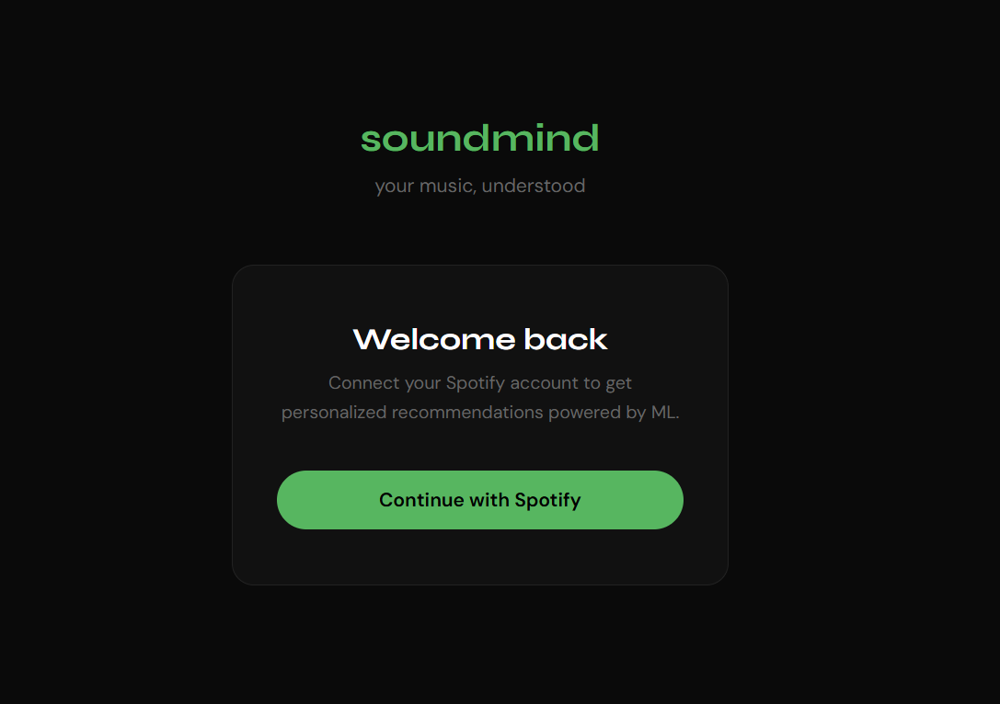
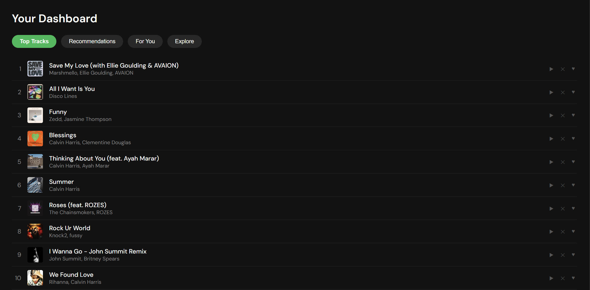

# soundmind

A music recommendation app powered by Spotify and ML. Authenticates via Spotify OAuth, analyzes your top tracks, and serves personalized recommendations through a tiered ML pipeline (content-based KNN, collaborative filtering via Matrix Factorization, and UMAP visualization).

## Visuals



## Tech Stack

| Layer | Technology |
|---|---|
| Frontend | React 19, Vite, React Router |
| Backend | Express 5, Node.js, express-session |
| ML Service | Python 3.11, FastAPI, scikit-learn, umap-learn |
| Database | MongoDB Atlas |
| External API | Spotify Web API (OAuth 2.0) |
| Container | Docker (supervisord — single container) |

## Architecture

```
Browser
  └── :5000 (Express)
        ├── GET /              → serves React SPA (client/dist)
        ├── GET /auth/login    → Spotify OAuth redirect
        ├── GET /callback      → OAuth callback, saves user & tracks
        ├── GET /api/*         → REST API (top tracks, feedback, UMAP)
        └── POST /api/recommend → proxies to FastAPI on :8000 (internal)
                                       ├── KNN content-based recs
                                       ├── Matrix Factorization recs
                                       └── UMAP 2D embedding
MongoDB Atlas (external)
```

## Quick Start (Docker)

### Prerequisites

- [Docker](https://docs.docker.com/get-docker/)
- A [Spotify Developer](https://developer.spotify.com/dashboard) app with a registered redirect URI
- A MongoDB Atlas cluster

### 1. Configure Spotify redirect URI

In your Spotify Developer Dashboard, add the following to **Redirect URIs**:

```
http://127.0.0.1:5000/callback
```

### 2. Set environment variables

The app reads credentials from `server/.env`. Create it if it doesn't exist:

```
SPOTIFY_CLIENT_ID=your_client_id
SPOTIFY_CLIENT_SECRET=your_client_secret
SPOTIFY_REDIRECT_URI=http://127.0.0.1:5000/callback
SESSION_SECRET=any_random_string
PORT=5000
MONGO_URI=mongodb+srv://<user>:<password>@<cluster>.mongodb.net/
```

### 3. Build the image

```bash
docker build -t soundmind .
```

First build takes 5–10 minutes (Python ML dependencies are large). Subsequent builds are cached.

### 4. Run the container

```bash
docker run --env-file server/.env -p 5000:5000 soundmind
```

Open [http://127.0.0.1:5000](http://127.0.0.1:5000) in your browser.

### Viewing logs

Process logs (Express + FastAPI) are written inside the container at `/app/logs/`. To tail them:

```bash
docker exec -it <container_id> tail -f /app/logs/server.log /app/logs/ml-service.log
```

## Environment Variables

| Variable | Required | Description |
|---|---|---|
| `SPOTIFY_CLIENT_ID` | Yes | From Spotify Developer Dashboard |
| `SPOTIFY_CLIENT_SECRET` | Yes | From Spotify Developer Dashboard |
| `SPOTIFY_REDIRECT_URI` | Yes | Must match the URI registered in Spotify — `http://127.0.0.1:5000/callback` for local use |
| `SESSION_SECRET` | Yes | Any random string used to sign session cookies |
| `PORT` | Yes | Port for the Express server — `5000` |
| `MONGO_URI` | Yes | MongoDB Atlas connection string |

## ML Pipeline

Three recommendation strategies are available, tried in order:

1. **KNN (content-based)** — Finds similar tracks using a pre-trained K-Nearest Neighbors model on 8 Spotify audio features (danceability, energy, loudness, speechiness, acousticness, instrumentalness, valence, tempo) plus genre one-hot encodings. Fast and always available.

2. **Matrix Factorization (collaborative)** — ALS-based model trained on accumulated user feedback (plays and likes). Improves with usage. Triggered via `POST /api/train-mf` after enough feedback is collected.

3. **UMAP visualization** — Reduces the track feature space to 2D for the interactive scatter plot in the dashboard. Computed once on first request, then cached in memory.

## Manual Setup (Development)

Run each service independently for local development.

### ML Service

```bash
cd ml-service
python -m venv .venv
# Windows:
.venv\Scripts\activate
# macOS/Linux:
source .venv/bin/activate

pip install -r requirements.txt
uvicorn main:app --reload --port 8000
```

### Server

```bash
cd server
npm install
node server.js
```

### Client

```bash
cd client
npm install
npm run dev
```

The client dev server runs on `http://127.0.0.1:5173` and the backend on `http://127.0.0.1:5000`. Make sure the server and ML service are both running before using the dashboard.
